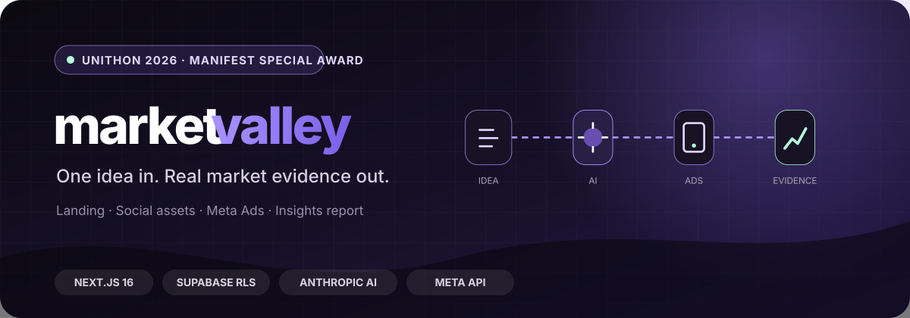
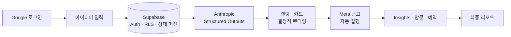

<p align="center">
  
</p>

<p align="center">
  <a href="https://marketvaley.vercel.app"><strong>서비스</strong></a> ·
  <a href="https://github.com/unithon26/marketvalley"><strong>소스 코드</strong></a> ·
  <a href="https://github.com/unithon26/marketvalley/blob/main/docs/demo-runbook.md"><strong>데모 실행서</strong></a> ·
  <a href="https://github.com/unithon26/marketvalley/blob/main/docs/validation.md"><strong>검증 기록</strong></a> ·
  <a href="https://github.com/unithon26/marketvalley/actions/workflows/ci.yml"><strong>CI</strong></a>
</p>

## 아이디어 한 번, 시장의 반응까지

marketvalley는 첫 시장 반응을 확인하려는 예비창업가와 1인 사업자를 위한 자동 시장검증
서비스입니다. 사용자가 문제 배경과 솔루션을 한 번 입력하면 같은 검증 가설에서 공개 랜딩,
Instagram 카드뉴스 5장, 광고 문구와 Meta 광고를 만들고 실제 방문·예약·Insights를 하나의
리포트로 돌려줍니다.

더 많은 콘텐츠를 빠르게 만드는 제품이 아닙니다. 고객을 만나기 전에 반복하던 채널별 재작성,
조판, 파일 정리, 광고 등록, 상태 확인과 데이터 취합을 없애고, 시장성 판단과 고객 대화는 사람에게
남깁니다.

> UNITHON 2026 매니패스트 특별상 공식 수상

## 우리가 없앤 일

| Before | After |
| --- | --- |
| 가치 제안과 CTA를 채널마다 다시 작성 | 문제와 솔루션을 한 번 입력 |
| 웹 빌더에서 랜딩을 직접 조립·배포 | 같은 spec에서 공개 URL 생성 |
| 카드 5장을 조판하고 파일로 정리 | 1080×1350 PNG 5장과 ZIP 생성 |
| 광고 소재·설정을 Ads Manager에 옮김 | 승인된 계정·예산 경계에서 자동 집행 |
| 상태를 확인하고 여러 표의 반응을 취합 | 실제 방문·예약·Insights 리포트 완성 |

사용자에게 남는 흐름은 `아이디어 입력 → 실제 반응 관찰 → 계속 검증할지 판단`입니다.

## 실제로 동작하는 흐름



브라우저가 닫혀도 Oracle worker가 Postgres lease 상태 머신을 이어서 처리합니다. 외부 API가
일시 실패하면 입력과 원래 단계를 보존한 채 재시도하고, 안전하게 복구할 수 없는 오류는 성공으로
꾸미지 않습니다.

```text
SUBMITTED → GENERATING → PREPARING → AWAITING_ACTIVATION
          → COLLECTING → FINALIZING → COMPLETED
```

## 신뢰할 수 있는 제품 경계

- Google OAuth, HttpOnly 세션과 Supabase RLS로 사용자별 광고·예약자명단을 격리합니다.
- 서버가 승인한 광고계정, 고정 lifetime 예산과 종료 시각이 일치할 때만 광고를 활성화합니다.
- 카드 미리보기, ZIP과 Meta 업로드는 같은 결정적 renderer를 사용합니다.
- 임의 지표 대신 저장된 Meta Insights, 고유 방문과 동의 기반 예약만 표시합니다.
- CI에서 lint, typecheck, 단위 테스트, production build, Chromium E2E, 비밀정보 비노출,
  Terraform과 container smoke를 검증합니다.

## 기술 스택

| 영역 | 사용 기술 |
| --- | --- |
| Product | Next.js 16 App Router, React 19, TypeScript, Zod |
| Data · Auth | Supabase Auth, PostgreSQL, RLS, RPC |
| AI · Ads | Anthropic Structured Outputs, Meta Marketing API · Insights |
| Rendering | React/CSS renderer, `ImageResponse`, JSZip |
| Delivery | Vercel, Oracle Cloud, rootless Docker Compose, Caddy |
| Quality | Vitest, Playwright, GitHub Actions, Terraform |

## 팀과 역할

2026년 8월 24일부터 26일까지 열린 UNITHON 2026에서 숭실대학교 학생 팀이 기획·개발·디자인을
함께 맡아 만들었습니다.

공개 구현 이력과 프로젝트 문서에서 확인되는 책임 범위만 적었습니다. 이름이 공개 Git 이력에서
확인되지 않는 비개발 기여는 역할로 구분했습니다.

| 팀원 | 역할 | 맡은 범위와 핵심 성과 |
| --- | --- | --- |
| [홍성주](https://github.com/ghdtjdwn) | Backend · AI · Platform | `CampaignSpec`, Anthropic 생성 계약, Supabase schema·RLS, 내부 API와 공개 route 데이터 경계, Meta·Insights, durable lifecycle, Vercel·Oracle 전달과 CI를 구현·통합해 입력부터 실제 광고·리포트까지 연결 · [PR #15](https://github.com/unithon26/marketvalley/pull/15) · [PR #17](https://github.com/unithon26/marketvalley/pull/17) |
| [박지성](https://github.com/jisung1017) | Product Frontend · UX | Figma 기반 홈·입력·진행·리포트 UI, 결정적 랜딩·카드 renderer, PNG·ZIP export, Google 로그인 진입과 production E2E를 구현 · [PR #1](https://github.com/unithon26/marketvalley/pull/1) · [PR #3](https://github.com/unithon26/marketvalley/pull/3) |
| Product Design | Visual System · Templates | 디자인 토큰, 랜딩 도입부 7종, 카드뉴스 표지 3종과 상태·발표 화면의 Figma 기준 제공 |

[역할과 파일 소유권](https://github.com/unithon26/marketvalley/blob/main/CONTRIBUTING.md#역할과-파일-소유권)에서
협업 경계를 확인할 수 있습니다.

<p align="center">
  <a href="https://marketvaley.vercel.app"><strong>marketvalley 직접 사용해 보기 →</strong></a>
</p>
